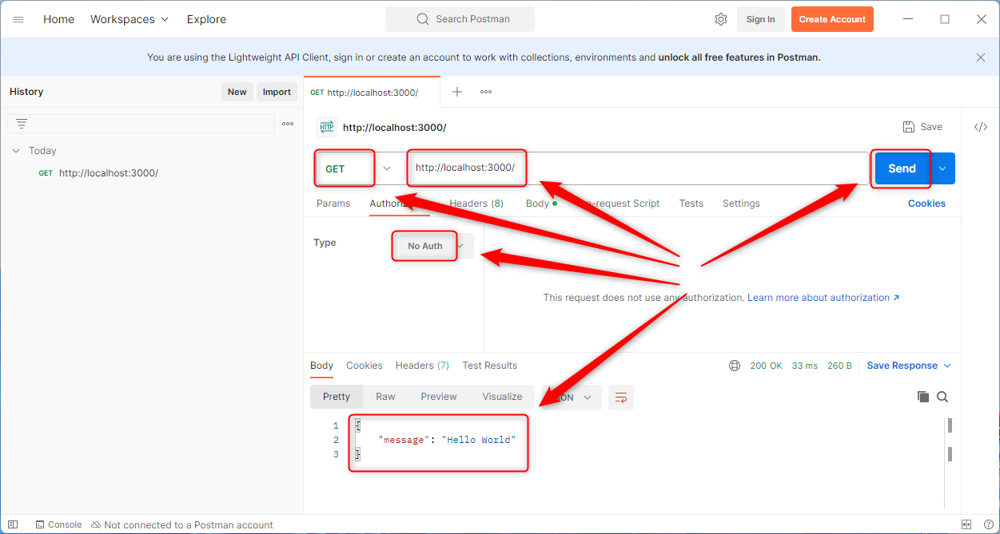
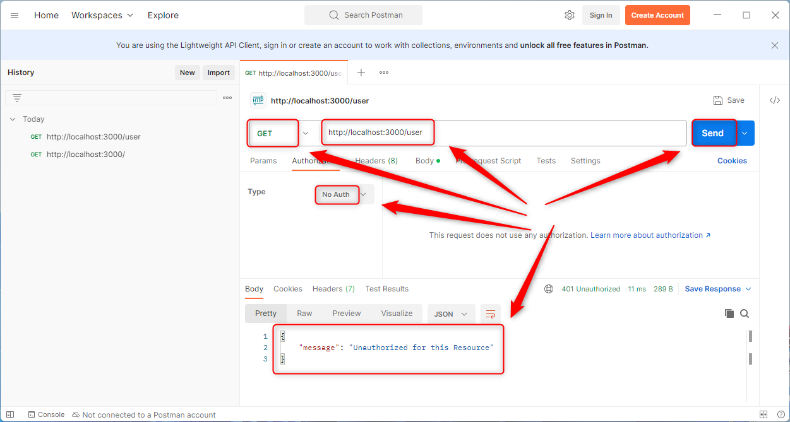
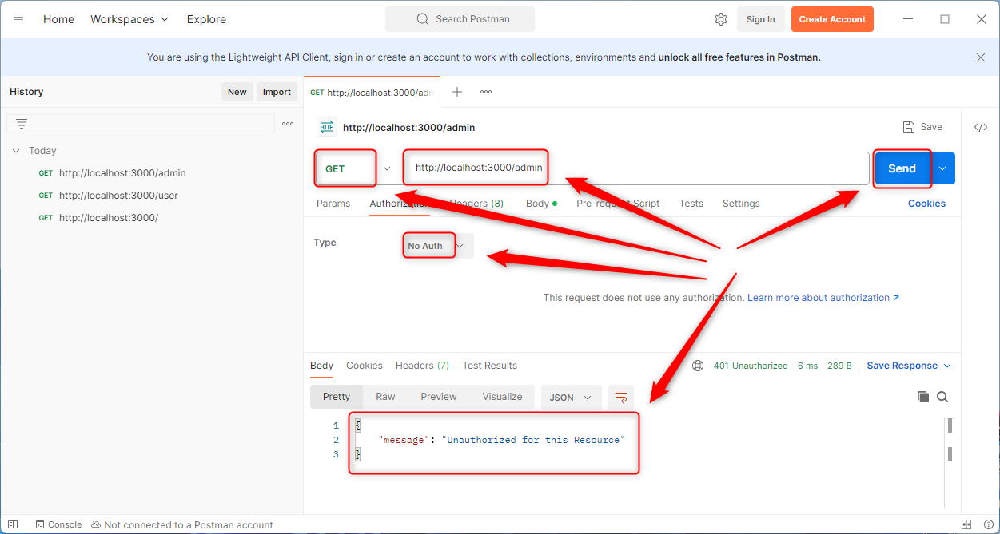
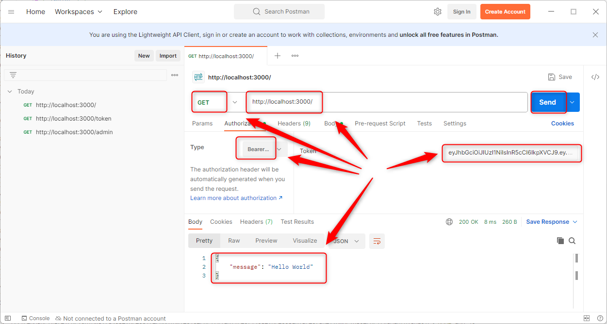
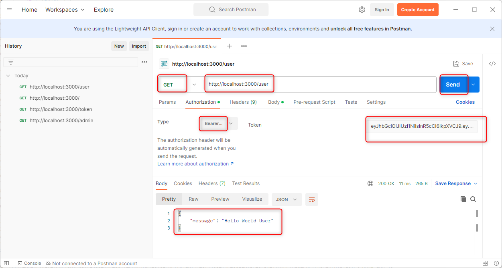
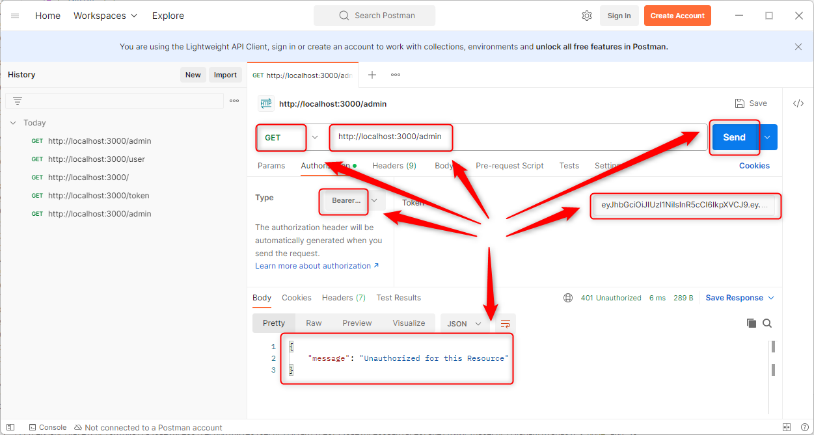
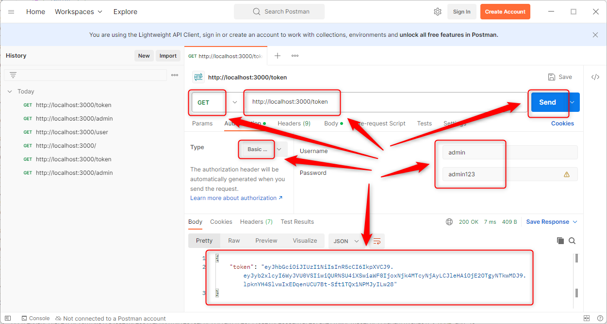
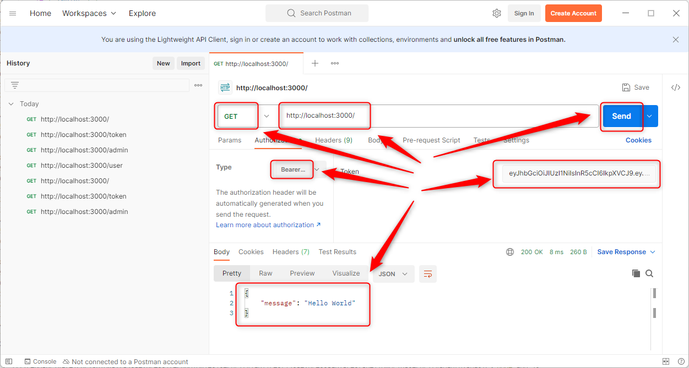
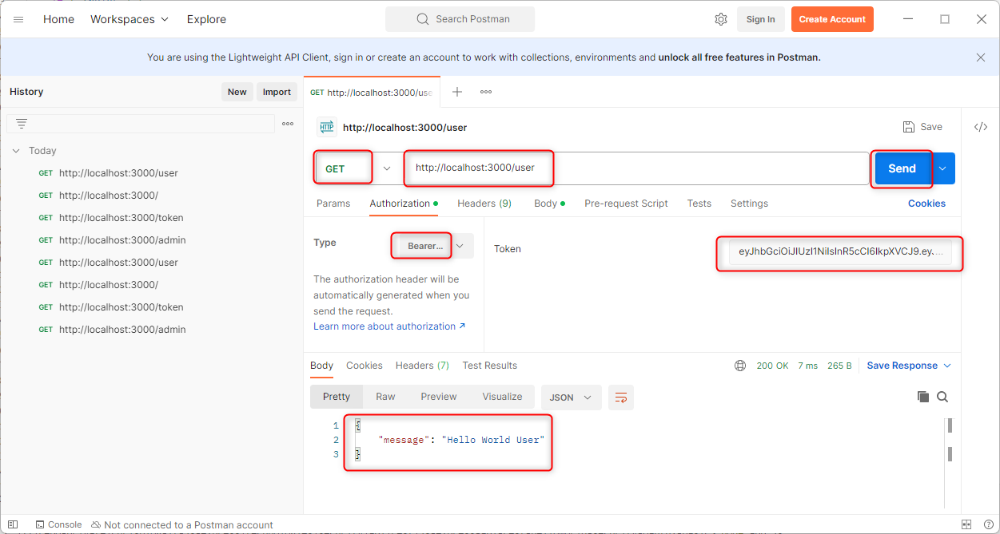

USAGE COMMANDS
--------------

> Please be aware that following tools should be installed in advance on your computer: **node.js**. 

> Please **clone/download** project, open **project's main folder** in your favorite **command line tool** and then **proceed with steps below**. 

Usage steps:
1. In a command line tool init nmp with `npm install`
1. In a command line tool start application with `node app.js`
1. In a http client (e.g. Postman) use **GET** method and **without any role** (authorization: **No Auth**, credentials: **none**) visit **public** page `http://localhost:3000`
   * Expected message **Hello World**
1. In a http client (e.g. Postman) use **GET** method and **without any role** (authorization: **No Auth**, credentials: **none**) visit **user** page `http://localhost:3000/user`
   * Expected message **Unauthorized for this Resource**
1. In a http client (e.g. Postman) use **GET** method and **without any role** (authorization: **No Auth**, credentials: **none**) visit **admin** page `http://localhost:3000/admin`
   * Expected message **Unauthorized for this Resource**
1. In a http client (e.g. Postman) use **GET** method and **USER role** (authorization: **Basic Auth**, credentials: **user/user123**) visit **public** page `http://localhost:3000`
   * Expected message **Hello World**
1. In a http client (e.g. Postman) use **GET** method and **USER role** (authorization: **Basic Auth**, credentials: **user/user123**) visit **user** page `http://localhost:3000/user`
   * Expected message **Hello World User**
1. In a http client (e.g. Postman) use **GET** method and **USER role** (authorization: **Basic Auth**, credentials: **user/user123**) visit **admin** page `http://localhost:3000/admin`
   * Expected message **Unauthorized for this Resource**
1. In a http client (e.g. Postman) use **GET** method and **ADMIN role** (authorization: **Basic Auth**, credentials: **admin/admin123**) visit **public** page `http://localhost:3000`
   * Expected message **Hello World**
1. In a http client (e.g. Postman) use **GET** method and **ADMIN role** (authorization: **Basic Auth**, credentials: **admin/admin123**) visit **user** page `http://localhost:3000/user`
   * Expected message **Hello World User**
1. In a http client (e.g. Postman) use **GET** method and **ADMIN role** (authorization: **Basic Auth**, credentials: **admin/admin123**) visit **admin** page `http://localhost:3000/admin`
   * Expected message **Hello World Admin**
1. Clean up environment 
     * In a command line tool stop application with `ctrl + C`

USAGE IMAGES
------------

DESCRIPTION
-----------

##### Goal
The goal of this project is to present how to **secure** using **Basic Authentication** an example application type **API REST** in **JavaScript** programming language with usage **express** framework. This application consists of three API endpoints: one public, one available for USER and ADMIN roles and one available only for ADMIN role. 

##### Terminology
Terminology explanation:
* **JavaScript**: is a scripting or programming language that allows you to implement complex features on web pages or to implement web applications.
* **API REST**: an architectural style for an application program interface (API) that uses HTTP requests to access and use data
* **Express framework**: Express.js is the most popular web framework for Node.js. It is designed for building web applications and APIs and has been called the de facto standard server framework for Node.js.

##### Flow
The following flow takes place in this project:
1. User via any http client sends request to application for the content.
1. Application sends back response to user via http client with message. This message depends on wheter the user has a proper role for this resource or not.

##### Launch
To launch this application please make sure that the **Preconditions** are met and then follow instructions from **Usage** section.

##### Technologies
This project uses following technologies:
* **JavaScript**: `https://docs.google.com/document/d/1wtk8TTIDLsHSvtyUp7uCk-pOKTpmNwMANRGmBNaoBpc/edit?usp=sharing`
* **Node** (section 'Node'): `https://docs.google.com/document/d/1wtk8TTIDLsHSvtyUp7uCk-pOKTpmNwMANRGmBNaoBpc/edit?usp=sharing`
* **Npm** (section 'Npm'): `https://docs.google.com/document/d/1wtk8TTIDLsHSvtyUp7uCk-pOKTpmNwMANRGmBNaoBpc/edit?usp=sharing`
* **Express framework** (section 'Express Framework'): `https://docs.google.com/document/d/1wtk8TTIDLsHSvtyUp7uCk-pOKTpmNwMANRGmBNaoBpc/edit?usp=sharing`

PRECONDITIONS
-------------

##### Preconditions - Tools
* Installed **Operating System** (tested on Windows 11)
* Installed **Node** (tested on version 18.18.1)

##### Preconditions - Actions
* Download **Source Code** (using Git or in any other way) 
* Open any **Command Line** tool (for instance "Windonw PowerShell" on Windows OS) on downloaded **project's main folder**