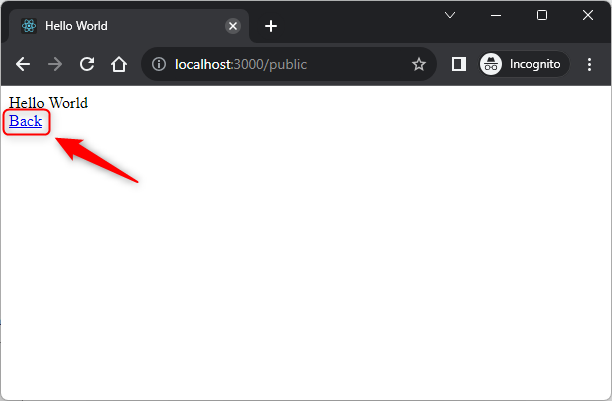

USAGE COMMANDS
--------------

> Please be aware that following tools should be installed in advance on your computer: **node.js**. 

> Please **clone/download** project, open **project's main folder** in your favorite **command line tool** and then **proceed with steps below**. 

Usage steps:
1. In a command line tool install nmp packages with `npm install`
1. In a command line tool start application with `node app.js`
1. In a html browser (e.g. Chrome) visit `http://localhost:3000`
   * Expected **Index** page
1. In a html browser (e.g. Chrome) on **Index** page click link redirecting to **Public** page
   * Expected **Public** page. Click **Back** link
1. In a html browser (e.g. Chrome) on **Index** page click link redirecting to **User** page
   * Expected **Unauthorized** page. Click **Back** link
1. In a html browser (e.g. Chrome) on **Index** page click link redirecting to **Admin** page
   * Expected **Unauthorized** page. Click **Back** link
1. In a html browser (e.g. Chrome) on **Index** page click link redirecting to **Login** page
   * Expected **Login** page. Click **Back** link
1. In a html browser (e.g. Chrome) on **Login** page set **user** credentials (user / user123) and click **Send** button
   * Expected **Index** page.
1. In a html browser (e.g. Chrome) on **Index** page click link redirecting to **Public** page
   * Expected **Public** page. Click **Back** link
1. In a html browser (e.g. Chrome) on **Index** page click link redirecting to **User** page
   * Expected **User** page. Click **Back** link
1. In a html browser (e.g. Chrome) on **Index** page click link redirecting to **Admin** page
   * Expected **Unauthorized** page. Click **Back** link
1. In a html browser (e.g. Chrome) on **Index** page click link **Logout**
   * Expected **Index** page.
1. In a html browser (e.g. Chrome) on **Index** page click link redirecting to **Login** page
   * Expected **Login** page. Click **Back** link
1. In a html browser (e.g. Chrome) on **Login** page set **admin** credentials (admin / admin123) and click **Send** button
   * Expected **Index** page.
1. In a html browser (e.g. Chrome) on **Index** page click link redirecting to **Public** page
   * Expected **Public** page. Click **Back** link
1. In a html browser (e.g. Chrome) on **Index** page click link redirecting to **User** page
   * Expected **User** page. Click **Back** link
1. In a html browser (e.g. Chrome) on **Index** page click link redirecting to **Admin** page
   * Expected **Admin** page.
1. Clean up environment 
     * In a command line tool stop application with `ctrl + C`

USAGE IMAGES
------------

DESCRIPTION
-----------

##### Goal
The goal of this project is to present how to implement **security** using **Form JWT** technology on an **example** application type **GUI HTML** in **JavaScript** programming language with usage **express** framework.

##### Terminology
Terminology explanation:
* **JavaScript**: is a scripting or programming language that allows you to implement complex features on web pages or to implement web applications.
* **GUI HTML**: it's an abbreviation for Graphical User Interface. It enables user to interact with application. GUI HTML means that user interacts with application via html web pag.
* **Express framework**: Express.js is the most popular web framework for Node.js. It is designed for building web applications and APIs and has been called the de facto standard server framework for Node.js.
* **Form JWT security**: this way of security means that user sends credentials as HTML form. If credentials are valid then JWT (JSON Web Token) is created and stored as cookie in a browser. This cookie is sent every request to application and checked if JWT is valid.

##### Flow
The following flow takes place in this project:
1. User via any html browser sends request to application for the content.
1. Application sends back response to user via html browser with message. User has access only to these resources 

##### Launch
To launch this application please make sure that the **Preconditions** are met and then follow instructions from **Usage** section.

##### Technologies
This project uses following technologies:
* **JavaScript**: `https://docs.google.com/document/d/1wtk8TTIDLsHSvtyUp7uCk-pOKTpmNwMANRGmBNaoBpc/edit?usp=sharing`
* **Node** (section 'Node'): `https://docs.google.com/document/d/1wtk8TTIDLsHSvtyUp7uCk-pOKTpmNwMANRGmBNaoBpc/edit?usp=sharing`
* **Npm** (section 'Npm'): `https://docs.google.com/document/d/1wtk8TTIDLsHSvtyUp7uCk-pOKTpmNwMANRGmBNaoBpc/edit?usp=sharing`
* **Express framework** (section 'Express Framework'): `https://docs.google.com/document/d/1wtk8TTIDLsHSvtyUp7uCk-pOKTpmNwMANRGmBNaoBpc/edit?usp=sharing`

PRECONDITIONS
-------------

##### Preconditions - Tools
* Installed **Operating System** (tested on Windows 11)
* Installed **Node** (tested on version 18.18.1)

##### Preconditions - Actions
* Download **Source Code** (using Git or in any other way) 
* Open any **Command Line** tool (for instance "Windonw PowerShell" on Windows OS) on downloaded **project's main folder**